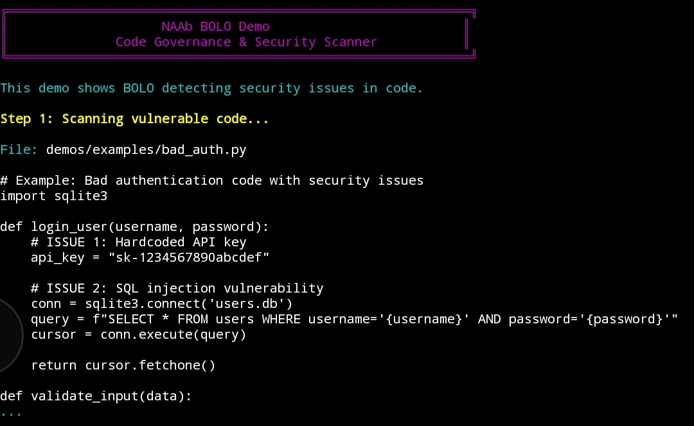
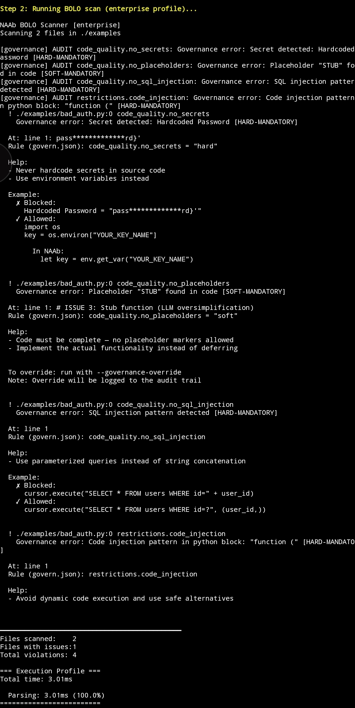
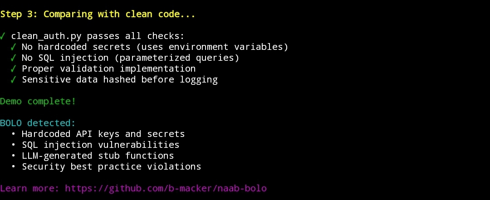

# NAAb BOLO

[](https://github.com/b-macker/naab-bolo/actions/workflows/ci.yml)
[](https://github.com/b-macker/naab-bolo/releases/tag/v1.0.0)
[](LICENSE)
[](https://github.com/b-macker/NAAb)
[](CONTRIBUTING.md)
[](https://github.com/b-macker/naab-bolo/discussions)

**"Be On the Lookout"** for bad code. Enterprise LLM & AI governance platform built 100% in [NAAb](https://github.com/b-macker/NAAb).

50+ static analysis checks. 5 governance profiles. SARIF, HTML, JSON, CSV, JUnit reports. 7 enforcement gates. 4 AI governance validators.

```
$ naab-lang scan.naab ./src --profile enterprise

NAAb BOLO Scanner [enterprise]
Scanning 47 files in ./src

  X src/auth.py:12 [no_secrets]
    Hardcoded API key detected
  X src/db.py:8 [no_sql_injection]
    String formatting in SQL query
  ! src/utils.py:45 [oversimplification.stub_function]
    Stub function: validate_input() contains only 'pass'

━━━━━━━━━━━━━━━━━━━━━━━━━━━━━━━━━━━━━━━━━━━━━
Files scanned:    47
Files with issues:3
Total violations: 3
```

---

## Why Polyglot?

Every block uses the **right language for the job**:

| Task | Language | Why |
|------|----------|-----|
| Pattern matching (50+ regex) | **C++** | `std::regex` compiles once, scans at native speed. 50x faster than Python `re`. |
| Report generation (SARIF/HTML) | **Python** | `json.dumps` for SARIF, f-strings + `html.escape` for HTML, `xml.etree` for JUnit. |
| Enforcement gates (7 gates) | **Python** | Gates RUN Python tools (pytest, flake8, bandit). You need Python to run Python tools. |
| AI governance (4 validators) | **Python** | AI/ML ecosystem is Python-native. YAML configs, model metadata, SHAP/LIME. |
| File discovery | **Shell** | `find` is universal, portable, and fast enough for file listing. |
| CLI orchestration | **NAAb** | Clean argument parsing, profile management, colored output, flow control. |

**Zero standalone .py files. Zero standalone .cpp files.** Everything lives in 5 NAAb scripts.

---

## Demo

See NAAb BOLO detecting security vulnerabilities and LLM-generated issues in real code:

### Step 1: Vulnerable Code
Example authentication code with **4 security issues**:



### Step 2: BOLO Scan Results 🔍
**Enterprise profile scan** detects all violations with detailed help:



BOLO detected:
- ✗ **Hardcoded secrets** - API key and password in source
- ✗ **SQL injection** - String concatenation in queries
- ✗ **LLM stub function** - `validate_input()` only contains `pass`
- ✗ **Code injection** - Unsafe `function()` in Python block

**Files scanned: 2 | Violations: 4 | Execution time: 3.01ms**

### Step 3: Clean Code Comparison ✅
Shows how to fix the issues:



**Try the demo yourself:**
```bash
cd demos
./bolo-demo.sh
```

See [DEMO_GUIDE.md](DEMO_GUIDE.md) for recording instructions.

---

## Quick Start

```bash
# Clone with NAAb submodule
git clone --recursive https://github.com/b-macker/naab-bolo.git
cd naab-bolo

# Build NAAb
bash build.sh

# Scan your code
./naab/build/naab-lang scan.naab /path/to/project --profile enterprise

# Generate SARIF report
./naab/build/naab-lang report.naab /path/to/project --format sarif --output report.sarif

# Run enforcement pipeline
./naab/build/naab-lang enforce.naab /path/to/project --stage ci

# AI governance check
./naab/build/naab-lang ai-check.naab /path/to/ml-project
```

---

## Commands

| Command | Script | Description |
|---------|--------|-------------|
| `scan` | `scan.naab` | Static analysis — 50+ checks via C++ governance engine |
| `report` | `report.naab` | Generate reports — SARIF 2.1.0, HTML, JSON, CSV, JUnit XML |
| `enforce` | `enforce.naab` | Enforcement pipeline — 7 gates, 17 validators, stage-based |
| `ai-check` | `ai-check.naab` | AI governance — model attestation, rate limiting, explainability |
| `profiles` | `bolo.naab` | List available governance profiles |

---

## Profiles

| Profile | Focus | Checks |
|---------|-------|--------|
| `enterprise` | Everything | All 50+ checks: LLM + security + AI + quality |
| `llm` | AI code quality | Oversimplification, hallucinated APIs, placeholders, apologetic language |
| `security` | Vulnerabilities | Secrets, injection, escalation, traversal, exfiltration |
| `ai-governance` | ML compliance | Model attestation, rate limiting, explainability, governance config |
| `standard` | Balanced | Core secrets + LLM anti-drift + shell injection |

---

## Report Formats

```bash
# SARIF 2.1.0 — for GitHub Code Scanning / VS Code
naab-lang report.naab ./src --format sarif --output report.sarif

# HTML — rich visual report with severity badges
naab-lang report.naab ./src --format html --output report.html

# JSON — structured data for tooling integration
naab-lang report.naab ./src --format json --output report.json

# CSV — spreadsheet-friendly
naab-lang report.naab ./src --format csv --output report.csv

# JUnit XML — CI test result integration
naab-lang report.naab ./src --format junit --output report.xml
```

---

## Enforcement Stages

```bash
# Pre-commit: fast checks only (compilation + lint)
naab-lang enforce.naab ./src --stage pre-commit

# CI: standard pipeline (6 gates + validators)
naab-lang enforce.naab ./src --stage ci

# PR merge: full validation (all 7 gates + all 17 validators)
naab-lang enforce.naab ./src --stage pr-merge
```

---

## GitHub Action

```yaml
- uses: b-macker/naab-bolo@v1
  with:
    path: ./src
    profile: enterprise
    format: sarif
```

---

## Architecture

```
5 NAAb scripts, 4 languages, 50+ checks, 6 test suites

bolo.naab ──── NAAb + Shell ──── CLI orchestration + file discovery
scan.naab ──── NAAb + Shell + C++ (via bolo stdlib) ──── Pattern matching engine
report.naab ── NAAb + Python ──── SARIF/HTML/JSON/CSV/JUnit generation
enforce.naab ─ NAAb + Python ──── 7 gates + 17 validators
ai-check.naab  NAAb + Python ──── 4 AI governance validators
```

---

## Testing

```bash
# Run all 6 test suites
bash tests/run-all-tests.sh

# Run individual suites
./naab/build/naab-lang tests/test-profiles.naab
./naab/build/naab-lang tests/test-scan.naab
./naab/build/naab-lang tests/test-report.naab
./naab/build/naab-lang tests/test-enforce.naab
./naab/build/naab-lang tests/test-ai.naab
./naab/build/naab-lang tests/test-integration.naab
```

---

## NAAb Ecosystem

**NAAb BOLO** is part of the NAAb ecosystem:

- **[NAAb Language](https://github.com/b-macker/NAAb)** — Core polyglot scripting language with governance
- **NAAb BOLO** (this project) — Code governance & AI validation
- **[NAAb Pivot](https://github.com/b-macker/naab-pivot)** — Code evolution & optimization (3-60x speedups)
- **[NAAb Passage](https://github.com/b-macker/naab-passage)** — Data gateway & PII protection (zero leakage)

---

## Contributing

Contributions are welcome! See [CONTRIBUTING.md](CONTRIBUTING.md) for build instructions and guidelines.

### Areas for Contribution
- Additional governance checks
- New enforcement validators
- IDE integrations
- Documentation improvements

---

## License

MIT License - see [LICENSE](LICENSE) for details.

**Brandon Mackert** - [@b-macker](https://github.com/b-macker)

---

_NAAb BOLO — Governance without the gatekeeping._
